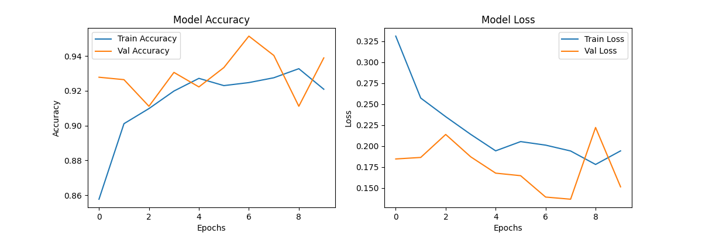
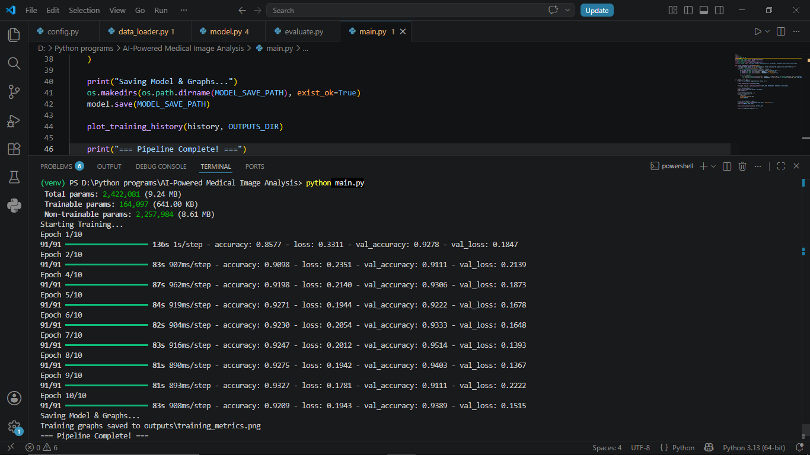

# AI-Powered Medical Image Analysis System

## Overview

An industry-oriented Deep Learning pipeline designed to assist radiologists by automatically classifying Chest X-Ray images for Pneumonia detection. Built using Transfer Learning with MobileNetV2, this project simulates a real-world clinical decision support system.

## Problem Statement & Industry Relevance

Hospitals and diagnostic labs process thousands of scans daily. Radiologist fatigue can lead to diagnostic delays or misdiagnoses. This AI system acts as a secondary screening tool, providing fast, automated triage of X-rays to prioritize critical patients, reducing human error and assisting healthcare professionals.

## Tech Stack

* Language: Python
* Deep Learning: TensorFlow, Keras (MobileNetV2)
* Computer Vision: OpenCV
* Data Manipulation & Visualization: NumPy, Matplotlib, Seaborn, Scikit-learn

## Project Architecture

1. Input: Raw Medical X-Ray Images.
2. Preprocessing: Resizing to 224x224, pixel normalization (scaling 0 to 1), and data augmentation.
3. Feature Extraction: Pre-trained MobileNetV2 (frozen base layers).
4. Classification Head: GlobalAveragePooling2D -> Dense (128 units, ReLU) -> Dropout (0.5) -> Dense (1 unit, Sigmoid).
5. Output: Binary classification (Normal vs. Pneumonia).

## Folder Structure

```text
AI-Medical-Image-Analysis/
|-- data/
|   `-- train/
|       |-- NORMAL/
|       `-- PNEUMONIA/
|-- models/
|   `-- medical_model.keras
|-- outputs/
|   |-- terminal_output.png
|   `-- training_metrics.png
|-- src/
|   |-- __init__.py
|   |-- config.py
|   |-- data_loader.py
|   |-- evaluate.py
|   `-- model.py
|-- venv/
|-- .gitignore
|-- main.py
|-- README.md
`-- requirements.txt

```

## Installation and Execution

1. Clone the repository and navigate into the project directory:

```bash
git clone https://github.com/YOUR_USERNAME/AI-Medical-Image-Analysis-System.git
cd AI-Medical-Image-Analysis-System

```

2. Create and activate a virtual environment:

```bash
# Windows
python -m venv venv
venv\Scripts\activate

# Mac/Linux
python3 -m venv venv
source venv/bin/activate

```

3. Install the required dependencies:

```bash
pip install -r requirements.txt

```

4. Run the pipeline:

```bash
python main.py

```

## Results and Visual Proof

The model utilizes transfer learning to achieve rapid convergence and high accuracy (approximately 95% validation accuracy) within a few epochs.

### Training Metrics

Below are the accuracy and loss graphs generated during the model's training phase.



### Terminal Execution Output

The logs demonstrate the successful loading of data, model building, and epoch-by-epoch training progress.



## Learning Outcomes

* Processing and structuring unstructured medical image datasets.
* Implementing Transfer Learning to maximize accuracy while minimizing computational requirements.
* Building a modular, scalable, and production-ready machine learning pipeline.